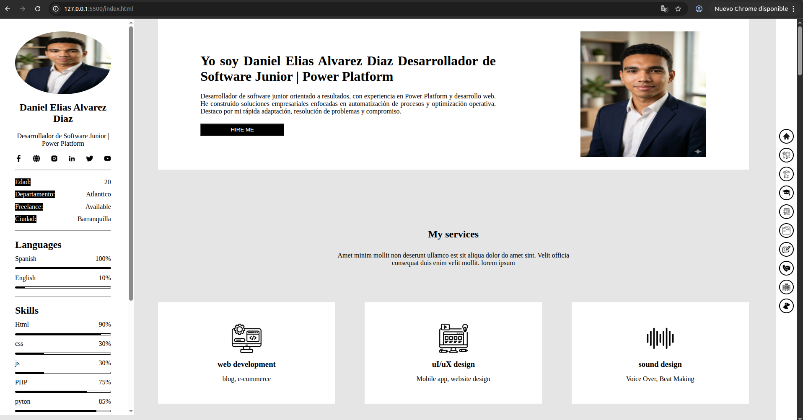
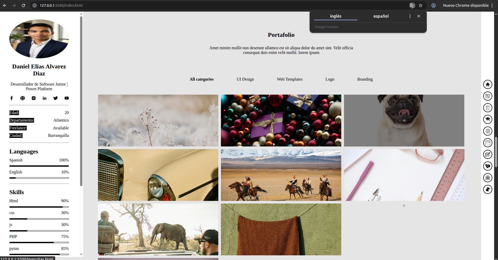
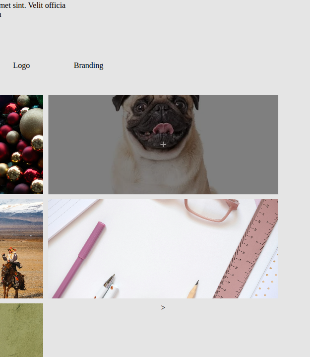
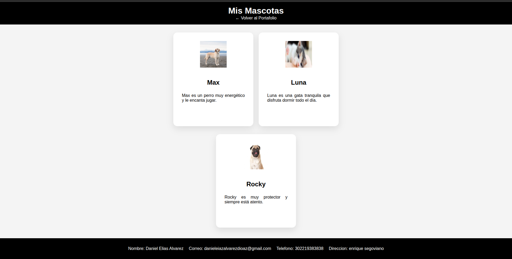
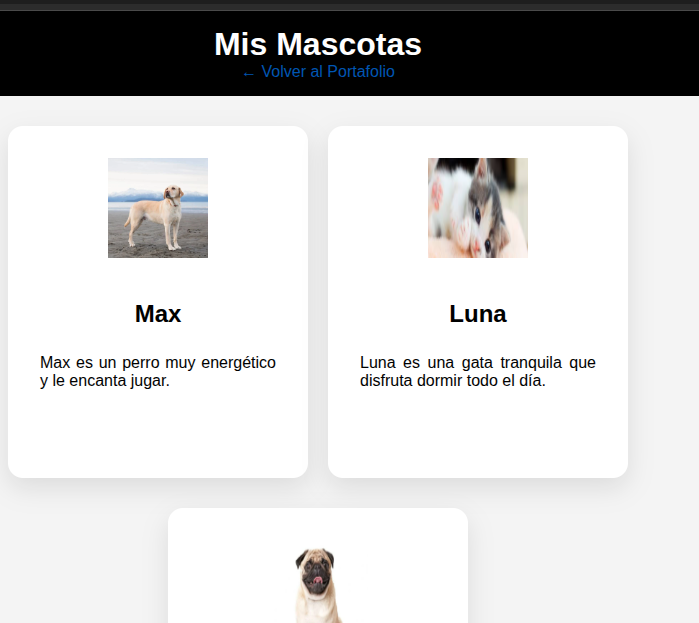

# 🧾 Sistema de Inventario en Python


-------------------------------------------------------------------------

## 📌 Descripción
- Estructura del Sitio Web: Este proyecto consiste en el desarrollo de una web de dos páginas:

- Index (Portafolio): Página principal enfocada en la marca personal.

- Mascotas: Página secundaria accesible mediante un enlace desde el portafolio, dedicada a la exhibición de contenido relacionado con animales domésticos.

------------------------------------------------------------------------

## 🚀 ¿Cómo acceder a esta versión del proyecto?

Para trabajar con esta versión desde tu computador, sigue estos pasos:

### 1. Clonar el repositorio

``` bash

git clone https://github.com/Dan623280/Portafolio.git
```

------------------------------------------------------------------------

### 2. Entrar a la carpeta del proyecto

``` bash

cd PORTAFILIO

```

------------------------------------------------------------------------

### 3. Cambiar a la rama correcta

``` bash
git checkout feature/H2
```

------------------------------------------------------------------------

### 4. Descargar los archivos de la rama

``` bash

git pull origin H2

```

------------------------------------------------------------------------

## ▶️ Ejecutar el index

Una vez dentro de la rama correcta, ejecuta:

index.html

------------------------------------------------------------------------

## ▶️ Como utilizar la pagina



Al iniciar, la página se presenta en la parte izquierda el nombre , los datos de contacto, y habilidades que tiene el autor, en la parte del centro vemos servicios, recomendaciones, educacion, Historial, portafolio, blog, datos de contacto y ubicacion atrvez de un mapa, y en la parte de la derecha un menu de navegacion para navegar dentro de toda la pagina, incluyendo un icono para redirigirse a la pagina de mascotas

## ir a la pagina mascotas




Para acceder a la sección de mascotas, simplemente haz clic en el contenedor de mascotas ubicado en el portafolio. Este enlace te redirigirá automáticamente a la página secundaria.


## pagina mascotas



En esta página se despliega una galería que muestra el nombre de cada mascota junto con una breve descripción personalizada.

## ir a la pagina portafolio



Para volver a la página principal, haz clic en el botón "Volver al Portafolio", el cual se encuentra en el encabezado (header), justo debajo del nombre.

------------------------------------------------------------------------
## 👤 Autor

Daniel Elias Alvarez Diaz

------------------------------------------------------------------------

## 🔗 Repositorio

https://github.com/Dan623280/Portafolio.git
